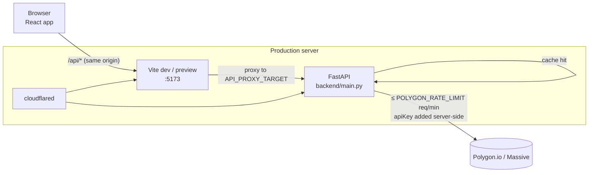

# Architecture

This document explains how the terminal is put together and why the backend is shaped the way it is. The short version: the browser never talks to Polygon directly. A small FastAPI service holds the API key, rations a very small request quota, caches everything it can, and falls back to end-of-day data when the plan doesn't include live data.

All file references are relative to the project root.

## Components

| Component | Code | Role |
|---|---|---|
| Browser UI | `frontend/src/` (React 19) | Renders the panels, polls quotes, the watchlist and movers, keeps the watchlist and portfolio in `localStorage`, and computes portfolio P&L |
| Vite server | `frontend/vite.config.js` | Serves the app (`vite` in dev, `vite preview` of the built `dist/` in production) and proxies every `/api/*` request to the backend |
| FastAPI backend | `backend/main.py` | Normalises Polygon responses, rate-limits, caches, coalesces, records denials, builds the EOD fallback, and generates the macro calendar |
| Polygon.io / Massive | `https://api.polygon.io` (`BASE_URL`) | Upstream market data: snapshots, aggregates, reference data, news, financials and options |
| Cloudflare Tunnel (production only) | systemd unit `cloudflared-bloomberg` | Publishes the two localhost services on public hostnames. See [OPERATIONS.md](OPERATIONS.md) |

## Request flow



In plain text:

```text
browser ──/api/quote/AAPL──▶ vite :5173 ──proxy──▶ FastAPI ──▶ [TTL cache] ──miss──▶ [denial memo]
                                                                      │                  │
                                                                      ▼                  ▼
                                                          [in-flight coalescing] ─▶ [FIFO rate-limit queue] ─▶ api.polygon.io
```

1. The frontend calls relative URLs such as `/api/quote/AAPL` (`frontend/src/api.js` uses axios with `baseURL: ''`). Because the call is same-origin, CORS doesn't apply.
2. Vite proxies `/api` to `API_PROXY_TARGET`. That's `http://localhost:8000` locally and `http://127.0.0.1:8010` in production. `vite preview` inherits the `server.proxy` setting.
3. The FastAPI handler calls `rate_limited_get()`, which adds the `apiKey` query parameter. The key never reaches the browser.
4. The handler reshapes Polygon's response into a small, flat JSON shape (for example `_normalize_snapshot`) before returning it.

The public API hostname, `bloomberg-api.adityatotlani.ch`, routes straight to FastAPI. The browser app doesn't use it. It exists for the Swagger docs and for direct API use. FastAPI's CORS allow-list (`localhost:5173`, `127.0.0.1:5173` and `https://bloomberg.adityatotlani.ch`) only matters for cross-origin callers.

## The upstream pipeline (`rate_limited_get`)

Every upstream call goes through one function, `rate_limited_get(url, params, family, ttl)` in `backend/main.py`. It applies these stages in order.

### 1. Tiered TTL caches

Each call names a TTL. Responses are stored in a `cachetools.TTLCache` dedicated to that TTL (`_cache_for(ttl)`, each with up to 512 entries). The cache key is the URL plus the sorted parameters.

| TTL | Used for |
|---|---|
| 10 s | Live snapshots: quote, watchlist and movers |
| 60 s | Intraday aggregates (1D and 5D charts) and the options chain |
| 300 s | News |
| 600 s | Daily and weekly aggregates (1M, 3M and 1Y charts), the recent daily bars used for EOD quotes, and grouped-daily market tables |
| 3600 s | Ticker search, ticker details, and financials/earnings |

A separate `eod_cache` (600 s, 1024 entries) holds the assembled whole-market EOD table and single-ticker EOD quotes.

Errors are never cached here. Only HTTP 200 bodies are stored.

### 2. Denial memo

Some calls are tagged with a `family` (`snapshot`, `options` or `financials`). When Polygon answers 403 (not entitled) or 410 (gone, during the vX deprecation brownout), the backend records the status in `_denied[family]` for `DENIAL_TTL`:

| Status | Remembered for | Why |
|---|---|---|
| 403 | 30 min | Plan entitlements don't change minute to minute |
| 410 | 5 min | Brownouts come and go, so the endpoint is retried sooner |

While a denial is remembered, calls in that family fail at once with the same status and cost no quota. Endpoints catch these failures (`_is_denied`, which also covers 401) and degrade: quotes switch to EOD, and options and financials return an `error` string.

### 3. In-flight coalescing

If an identical request (same cache key) is already on its way upstream, later callers wait on the same `asyncio.Task` (`_inflight`, `_Inflight`) instead of queueing a second call. The shared task runs in a fresh `contextvars.Context` so it doesn't belong to whichever request started it. Callers await it through `asyncio.shield`, so one client disconnecting doesn't cancel the task for everyone else.

This matters because every open browser tab polls `/api/quote/{ticker}` every 2 seconds.

### 4. FIFO rate-limit queue

`_acquire_slot()` hands out upstream slots in arrival order using a ticket counter (`_ticket_next` / `_ticket_serving`) and an `asyncio.Condition`. The limiter is a sliding 60-second window. A slot is free when fewer than `RATE_LIMIT` (`POLYGON_RATE_LIMIT`, default 5) requests went out in the last 60 seconds.

- **Ceiling:** a request that can't get a slot within `MAX_QUEUE_WAIT = 75` s fails with **503** "Data provider rate limit busy — retry shortly". It fails early if it can already tell it would pass the deadline. The frontend retries 503s (see below).
- **Abandonment:** while it waits, a queued call checks whether *all* the HTTP clients waiting on it have disconnected (`_Inflight.all_clients_gone`). If they have, it leaves the queue with **499** and logs `Dropped queued upstream call ...`. The frontend aborts a ticker's requests when the user switches tickers, so stale work doesn't hold on to the scarce slots. Internal callers that have no HTTP request, such as the shared EOD table build, are never abandoned.
- Abandoned tickets are skipped when the queue advances (`_abandoned`, `_advance_queue`).

### 5. 429 backoff

If Polygon still answers 429, for example because a restart wiped the local window count, the backend treats its window as full (`_request_times = [now] * RATE_LIMIT`) and retries once through the queue. A second 429 becomes a 503.

Upstream requests use `httpx` with a 15 s timeout. A timeout becomes **504** "Data provider timed out — retry shortly". Any other `httpx` request error (connection refused, DNS, TLS, dropped connection), or a 200 response whose body isn't valid JSON, becomes **502**. Both log a warning that names the endpoint path but not the query string, which holds the API key. The shared coalesced task raises the error, so every waiter gets the same one, and nothing is cached. The slot the attempt used still counts against the minute.

`/api/health` reports a `data` field (`live` / `eod` / `unknown`) from local state: `eod` while `snapshot` is in the denial memo, and `live` after a successful upstream `snapshot`-family call since startup (`_last_live_snapshot`, cleared when snapshots are denied). It never calls Polygon.

## End-of-day fallback

The free tier isn't entitled to `/v2/snapshot/...`. When a snapshot call is denied:

- **`_eod_market()`** builds a whole-market table in 3 upstream requests:
  1. It fetches SPY's recent daily bars to learn the last two trading dates, since SPY trades every session.
  2. It fetches the grouped-daily bars for the previous session, which supply the previous close.
  3. It fetches the grouped-daily bars for the last session.

  Each row becomes a quote through `_eod_quote()`: price = session close, change = close − previous close. The table is cached for 10 minutes and serves `/api/watchlist` and `/api/movers/*`.
- **`_eod_single_quote(ticker)`** serves `/api/quote/{ticker}`. It first looks the ticker up in the cached market table, which costs nothing. Otherwise it fetches that ticker's last 10 days of daily bars (1 request) and uses the last two.
- Every quote carries `source: "live"` or `source: "eod"`. The UI shows **EOD · DELAYED** in the quote panel and **END-OF-DAY DATA** under the monitor lists when it sees `eod`.
- EOD movers are filtered to price ≥ $5 and volume ≥ 1,000,000 (`MOVERS_MIN_PRICE`, `MOVERS_MIN_VOLUME`). Without that filter, illiquid penny stocks would dominate the ranking.

## Frontend data loading

`frontend/src/App.jsx` owns the per-ticker state.

- **Parallel loading:** selecting a ticker fires news, chart, ticker details, financials, options and earnings at once. The quote loads alongside them. The backend queue does the pacing. News is fired first so it gets the earliest slot.
- **Abort on ticker switch:** each ticker gets an `AbortController`. Switching tickers aborts the previous one's requests, which lets the backend drop them from its queue (the 499 path). Responses for a ticker the user has already left are also ignored.
- **Abort on timeframe change:** the chart has its own `AbortController`. Each chart load aborts the previous one, and the ticker's controller aborts it too. Bars are applied only if the response belongs to the newest load and still matches the current ticker and timeframe, so a slow older timeframe can't overwrite a newer one.
- **Retry on transient errors:** `withBusyRetry` retries 502, 503 and 504 up to 4 attempts in total, 3 s apart, and the panel stays in LOADING meanwhile. Other errors show at once.
- **Reasons, not blanks:** if a response has an `error` field (for example the options add-on message), or a request fails, the panel shows that text instead of a bare "NO DATA". This includes the EARNINGS tab.
- **Polling cadence:**

| What | Interval | Notes |
|---|---|---|
| Quote for the active ticker | 2 s | A tick is skipped if the previous poll is still pending. The backend caches for 10 s, so this costs at most 6 upstream calls a minute, and none in EOD mode |
| Watchlist / PORT holdings | 15 s | One batched `/api/watchlist` request. Only the visible monitor tab polls |
| Gainers / losers | 60 s | Only while that tab is open |
| `/api/health` | 10 s | Drives the top-bar indicator: LIVE, EOD DATA, CONNECTED (freshness unknown) or DISCONNECTED |
| Economic events | once at page load | Generated locally by the backend, so it costs no quota |

## Quota budget on the free tier

A ticker switch on the free tier typically needs these upstream requests: news (1), chart (1), ticker details (1), and financials and earnings together (1, because both endpoints use identical parameters and so share one cached or coalesced call). The quote costs 0 if the EOD market table is warm, otherwise 1. Options cost 0 once the 403 is remembered. That makes 4–5 requests, which is roughly one minute of a 5 req/min budget, and every visitor shares it. That's why panels fill one by one. Raising `POLYGON_RATE_LIMIT` on a paid plan removes the wait (see [OPERATIONS.md](OPERATIONS.md)).

## Economic calendar

`_macro_events()` builds the MACRO list without calling any external service. It uses hard-coded official dates for FOMC, CPI, Non-Farm Payrolls and GDP, plus rule-based estimates past the published schedules, and returns the events from 90 days ago to 180 days ahead. Sources, rules and the yearly update procedure are in [DATA-SOURCES.md](DATA-SOURCES.md#economic-calendar).

## State and persistence

- The backend keeps all state in process memory: caches, the denial memo, the rate-limit window and the queue. Restarting `bbg-api` clears all of it. There is no database.
- The frontend stores the watchlist (`bbg.watchlist`, at most 50 symbols; longer saved lists are trimmed on load) and portfolio holdings (`bbg.portfolio`, as exact decimal strings) in `localStorage`. Portfolio valuation is a pure client-side calculation in `frontend/src/lib/portfolio.js`. The method is described in [DATA-SOURCES.md](DATA-SOURCES.md#portfolio-pl-methodology).

## Time zones

- Backend dates such as "today", aggregate ranges and the calendar window are computed in **UTC** (`datetime.utcnow()`).
- Bar timestamps (`t`) are Unix epoch **milliseconds, UTC**. The chart passes them to lightweight-charts as UTC seconds, so intraday axis labels are in UTC, not New York time.
- Calendar events are plain dates. The official US release time is 8:30 AM ET for CPI, NFP and GDP, but the UI doesn't show times.
- News timestamps are shown in the viewer's local time zone. The top-bar clocks show New York, London and Tokyo.

## Known limitations

- `/api/watchlist` quietly drops symbols that fail its pattern and caps the list at 50. The WATCH tab enforces the same cap (`MAX_WATCHLIST` in `backend/main.py`, mirrored in `frontend/src/lib/limits.js`), so the two must be changed together.
- The top-bar `EOD DATA` / `LIVE` state reflects the most recent upstream snapshot outcome, so after a 403 denial expires it shows `CONNECTED` until the next quote, watchlist or movers request re-checks it.
- The `updated` field uses different units by source: EOD rows carry the bar's epoch milliseconds, while live rows pass Polygon's snapshot `updated` through unchanged (nanoseconds in Polygon's snapshot format). The UI doesn't read it.
- On the free tier, the 1D chart covers yesterday and today in UTC, so it can be empty on weekends and early on Mondays.
- The docstring of `_macro_events` says "next 12 months", but the code returns −90 to +180 days.
