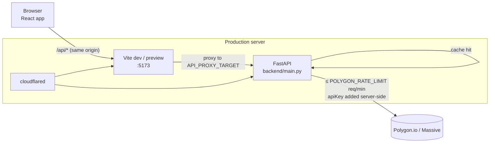

# Architecture

This document explains how the terminal is put together and why the backend is shaped the way it is. The short version: the browser never talks to Polygon directly. A small FastAPI service holds the API key, rations a very small request quota, caches everything it can, and falls back to end-of-day data when the plan doesn't include live data.

All file references are relative to the project root.

## Components

| Component | Code | Role |
|---|---|---|
| Browser UI | `frontend/src/` (React 19) | Renders the panels, polls quotes, the watchlist and movers, keeps the watchlist and portfolio in `localStorage`, and computes portfolio P&L |
| Vite server | `frontend/vite.config.js` | Serves the app (`vite` in dev, `vite preview` of the built `dist/` in production) and proxies every `/api/*` request to the backend |
| FastAPI backend | `backend/main.py` | Normalises Polygon responses, rate-limits, caches, coalesces, records denials, builds the EOD fallback, and generates the macro calendar |
| Polygon.io / Massive | `https://api.polygon.io` (`BASE_URL`) | Upstream market data: snapshots, aggregates, reference data, news, financials and options |
| Cloudflare Tunnel (production only) | systemd unit `cloudflared-bloomberg` | Publishes the two localhost services on public hostnames. See [OPERATIONS.md](OPERATIONS.md) |

## Request flow



In plain text:

```text
browser ──/api/quote/AAPL──▶ vite :5173 ──proxy──▶ FastAPI ──▶ [TTL cache] ──miss──▶ [denial memo] ──▶ [negative cache]
                                                                                                          │
                                                                                                          ▼
                       api.polygon.io ◀── [FIFO rate-limit queue + breaker gate] ◀── [breaker fast-fail] ◀── [in-flight coalescing]
```

1. The frontend calls relative URLs such as `/api/quote/AAPL` (`frontend/src/api.js` uses axios with `baseURL: ''`). Because the call is same-origin, CORS doesn't apply.
2. Vite proxies `/api` to `API_PROXY_TARGET`. That's `http://localhost:8000` locally and `http://127.0.0.1:8010` in production. `vite preview` inherits the `server.proxy` setting.
3. The FastAPI handler calls `rate_limited_get()`, which adds the `apiKey` query parameter. The key never reaches the browser.
4. The handler reshapes Polygon's response into a small, flat JSON shape (for example `_normalize_snapshot`) before returning it.

The public API hostname, `bloomberg-api.adityatotlani.ch`, routes straight to FastAPI. The browser app doesn't use it. It exists for the Swagger docs and for direct API use. FastAPI's CORS allow-list (`localhost:5173`, `127.0.0.1:5173` and `https://bloomberg.adityatotlani.ch`) only matters for cross-origin callers.

## The upstream pipeline (`rate_limited_get`)

Every upstream call goes through one function, `rate_limited_get(url, params, family, ttl)` in `backend/main.py`. It applies these stages in order.

### 1. Tiered TTL caches

Each call names a TTL. Responses are stored in a `cachetools.TTLCache` dedicated to that TTL (`_cache_for(ttl)`, each with up to 512 entries). The cache key is the URL plus the sorted parameters.

| TTL | Used for |
|---|---|
| 10 s | Live snapshots: quote, watchlist and movers |
| 60 s | Intraday aggregates (1D and 5D charts) and the options chain |
| 300 s | News |
| 600 s | Daily and weekly aggregates (1M, 3M and 1Y charts), the recent daily bars used for EOD quotes, and grouped-daily market tables |
| 3600 s | Ticker search, ticker details, and financials/earnings |

A separate `eod_cache` (600 s, 1024 entries) holds the assembled whole-market EOD table and single-ticker EOD quotes.

Errors are never cached here. Only HTTP 200 bodies are stored. (Provider failures have their own short-lived negative cache, stage 2b below, which stores only our status and message.)

### 2. Denial memo

Some calls are tagged with a `family` (`snapshot`, `options` or `financials`). When Polygon answers 403 (not entitled) or 410 (gone, during the vX deprecation brownout), the backend records the status in `_denied[family]` for `DENIAL_TTL`:

| Status | Remembered for | Why |
|---|---|---|
| 403 | 30 min | Plan entitlements don't change minute to minute |
| 410 | 5 min | Brownouts come and go, so the endpoint is retried sooner |

While a denial is remembered, calls in that family fail at once with the same status and cost no quota. The memo stores the short client-facing message from `DENIAL_DETAIL` ("Data provider: not included in the current data plan (HTTP 403)" / "Data provider endpoint deprecated or temporarily unavailable (HTTP 410)"), never Polygon's body. Endpoints catch these failures (`_is_denied`: 403/410) and degrade: quotes switch to EOD, and options and financials return an `error` string.

A **401** (Polygon rejected the key) is handled differently, because it affects every family and every fallback would fail the same way. `_is_auth_failure` spots it (a 401, or another status whose body says `"Unknown API Key"`, which is how `vX/reference/financials` answers). The backend sets `_auth_error_at`, raises a 401 with an actionable `detail` instead of Polygon's body, and adds **nothing** to the denial memo, so once the key is fixed and the service restarted, requests go straight upstream. `_is_denied` excludes 401, so no slot is wasted on an EOD fallback that would also fail. Any 200 from Polygon clears `_auth_error_at`.

### 2b. Negative cache and circuit breaker (provider failures)

A **provider failure** is the 502/504 class: a timeout (504), an unreachable host (502), an upstream 5xx or unfollowed 3xx (mapped to 502), or a 200 whose body isn't valid JSON (502). Every retry of one used to be a fresh upstream call, so during a Polygon incident the panels' automatic retries could spend most of the free tier's 5 requests a minute. Two layers stop that, and both act before any quota is spent:

- **Negative cache** (`_provider_failed`, a `TTLCache` of 1024 entries, `NEGATIVE_TTL = 20` s). When a call fails at the provider, its cache key (the same URL + parameters key as the success caches) is stored with the status and our short `detail`, never Polygon's body. For the next 20 s the same call gets that error straight away, with no upstream call. `/api/financials` and `/api/earnings` share a key, so they share the entry too.
- **Circuit breaker** (global; `BREAKER_THRESHOLD = 3`, `BREAKER_COOLDOWN = 20` s). Each provider failure adds to a count of consecutive failures; any non-failure answer from Polygon resets it. At 3 the breaker **opens**: for 20 s every *new* upstream call fails fast with **503** `"Data provider having issues — retry shortly"` and a `Retry-After` header. The check runs in three places: before a new call is queued (`_breaker_rejects` in `rate_limited_get`), at the head of the queue before a slot is taken (`_breaker_gate` in `_acquire_slot`), and for a head that is waiting for a slot and would still find the breaker open when the slot frees. So a call that queued before the breaker opened leaves without spending a slot.
- **Half-open probe.** After the cooldown, the next call to reach the head of the queue becomes the single probe (`_breaker_probing`). Calls behind it wait in the queue (they keep their place, and the 75 s ceiling and abandonment still apply) instead of failing. If the probe gets any answer that isn't a provider failure, the breaker **closes**, the negative cache is cleared (those entries belonged to the same incident) and the waiters go upstream normally. If the probe fails, the breaker re-opens for another 20 s and the waiters get the 503 without spending quota. A probe that ends without a verdict (for example cancelled at shutdown) releases the probe flag, so the next call probes instead.
- **What never counts as a failure:** any 4xx answer from Polygon, which includes 401 (auth error), 403/410 (denial memo), 404 and 429 (429 backoff). These mean Polygon is answering, so they reset the count, and a straggler's success while the breaker is open closes it. Our own 503 (rate-limit queue) and 499 (abandoned) never reach the breaker, because no upstream response is involved.
- **Composition.** The order in `rate_limited_get` is: success cache → denial memo → negative cache → join an identical in-flight call (always allowed, because it costs nothing, even while the breaker is open) → breaker fast-fail → new coalesced call → FIFO queue with the breaker gate. A coalesced failure counts once and is replayed to every waiter. The data-mode and auth tracking are unchanged: a provider failure says nothing about the key or the plan.
- **Logging.** Transitions are logged at WARNING with a status or exception class and a path only: `Provider circuit breaker OPEN after 3 consecutive failures (last: HTTP 500 for /v2/reference/news); failing fast for 20s`, `... HALF-OPEN: probing with <path>`, `... OPEN: probe failed (<reason> for <path>); ...` and `... CLOSED: provider answered HTTP <status> for <path>`. Bodies and URLs with the key are never logged.
- **`/api/health`** reports `"provider": "degraded"` while the breaker is open or probing, and `"ok"` otherwise. It reads local state only.

**Upstream cost during an outage.** One key costs at most one upstream call per 20 s window. Across the whole app, a sustained outage costs the 3 failures that open the breaker, then one probe per 20 s cooldown (at most 3 a minute, and only when something is asking). In the mocked test (7 endpoints polled every 2 s for 2 minutes, 420 client calls), 8 upstream calls went out.

**Why 20 s for both windows.** They match the frontend's final retry, which comes about 21 s after the first failure (3 s, 6 s and 12 s backoff, below). Attempts 2 and 3 are free replays, and the last attempt lands just after both windows, so it is a real retry, or it waits behind the probe, instead of being a replay of a stale error. A longer cooldown would make the last retry always fail during a brief blip. A shorter one would spend more quota on probes in a long outage.

### 3. In-flight coalescing

If an identical request (same cache key) is already on its way upstream, later callers wait on the same `asyncio.Task` (`_inflight`, `_Inflight`) instead of queueing a second call. The shared task runs in a fresh `contextvars.Context` so it doesn't belong to whichever request started it. Callers await it through `asyncio.shield`, so one client disconnecting doesn't cancel the task for everyone else.

This matters because every open browser tab polls `/api/quote/{ticker}` every 2 seconds.

### 4. FIFO rate-limit queue

`_acquire_slot()` hands out upstream slots in arrival order using a ticket counter (`_ticket_next` / `_ticket_serving`) and an `asyncio.Condition`. The limiter is a sliding 60-second window. A slot is free when fewer than `RATE_LIMIT` (`POLYGON_RATE_LIMIT`, default 5) requests went out in the last 60 seconds.

- **Ceiling:** a request that can't get a slot within `MAX_QUEUE_WAIT = 75` s fails with **503** "Data provider rate limit busy — retry shortly". It fails early if it can already tell it would pass the deadline. The frontend retries 503s (see below).
- **Abandonment:** while it waits, a queued call checks whether *all* the HTTP clients waiting on it have disconnected (`_Inflight.all_clients_gone`). If they have, it leaves the queue with **499** and logs `Dropped queued upstream call ...`. The frontend aborts a ticker's requests when the user switches tickers, so stale work doesn't hold on to the scarce slots. Internal callers that have no HTTP request, such as the shared EOD table build, are never abandoned.
- Abandoned tickets are skipped when the queue advances (`_abandoned`, `_advance_queue`).

### 5. 429 backoff

If Polygon still answers 429, for example because a restart wiped the local window count, the backend treats its window as full (`_request_times = [now] * RATE_LIMIT`) and retries once through the queue. A second 429 becomes a 503.

Upstream requests use `httpx` with a 15 s timeout. A timeout becomes **504** "Data provider timed out — retry shortly". Any other `httpx` request error (connection refused, DNS, TLS, dropped connection), or a 200 response whose body isn't valid JSON, becomes **502**. Both log a warning that names the endpoint path but not the query string, which holds the API key. The shared coalesced task raises the error, so every waiter gets the same one, and nothing goes in the success caches. The slot the attempt used still counts against the minute, but the negative cache and circuit breaker (stage 2b) stop retries from spending more.

A 403/410 keeps its status (endpoints in a degrading family inspect it with `_is_denied`), but its `detail` is the fixed `DENIAL_DETAIL` message, so endpoints outside those families (search, aggs, news, ticker-details, the EOD fallback's bar calls) never pass Polygon's body to the client.

Any other non-200 answer that isn't a 429 or an auth failure gets `detail` `"Data provider error (HTTP <status>)"`. A 4xx (for example 404 for an unknown symbol) keeps its status and is not retried by the frontend. A 5xx (500–599), or a non-error status such as an unfollowed 3xx, becomes **502** with " — retry shortly" appended and the original status in the message, so the panels' bounded retry applies. It is also a provider failure for the negative cache and breaker. Our own 503 (rate-limit queue) and 504 (timeout) are raised earlier and are unaffected.

For all of these the backend logs `Polygon returned HTTP <status> for <path>` (status and path only, never the body or the query string, which holds the API key), and nothing goes in the success caches. The order matters: `_is_auth_failure` reads the body first (to catch `"Unknown API Key"`), before any of this replaces it.

### 6. Data mode (`/api/health`)

`/api/health` reports a `data` field from local state only; it never calls Polygon.

- **Sticky last-known evidence** (`_mode_evidence`, a `(mode, observed_at)` pair). `_record_mode("live")` runs when a `snapshot`-family call succeeds upstream, and `_record_mode("eod")` when one gets 403/410. Nothing else changes it. In particular, the denial memo expiring doesn't reset it: that only means the next snapshot request re-probes, and the last evidence stands until then.
- **Persistence.** `_record_mode` writes `backend/.state.json` (`BBG_STATE_FILE` overrides the path) atomically, via a temp file in the same directory, `fsync` and `os.replace`. It writes when the mode changes, and at most hourly (`STATE_REFRESH`) while it doesn't, so `observed_at` reflects the last confirmation and not the last change. `_load_mode_evidence` reads it at import time and ignores it if it is missing, unreadable, malformed, from the future, or older than `STATE_MAX_AGE` (48 h, since a plan can change while the service is down). A write failure is logged and the in-memory mode still updates. The file contains only the mode and a timestamp.
- **Auth errors** (`_auth_error_at`, above) take precedence and report `auth_error`. They are memory-only: a restart is how a fixed key gets picked up, so it must start clean.
- Resolution order in `_data_mode()`: `auth_error` → last live/eod evidence → `unknown`.

The denial memo itself is not persisted, so after a restart the first snapshot request still probes Polygon once (one request) and re-confirms the mode.

## End-of-day fallback

The free tier isn't entitled to `/v2/snapshot/...`. When a snapshot call is denied:

- **`_eod_market()`** builds a whole-market table in 3 upstream requests:
  1. It fetches SPY's recent daily bars to learn the last two trading dates, since SPY trades every session.
  2. It fetches the grouped-daily bars for the previous session, which supply the previous close.
  3. It fetches the grouped-daily bars for the last session.

  Each row becomes a quote through `_eod_quote()`: price = session close, change = close − previous close. The table is cached for 10 minutes and serves `/api/watchlist` and `/api/movers/*`.
- **`_eod_single_quote(ticker)`** serves `/api/quote/{ticker}`. It first looks the ticker up in the cached market table, which costs nothing. Otherwise it fetches that ticker's last 10 days of daily bars (1 request) and uses the last two.
- Every quote carries `source: "live"` or `source: "eod"`. The UI shows **EOD · DELAYED** in the quote panel and **END-OF-DAY DATA** under the monitor lists when it sees `eod`.
- EOD movers are filtered to price ≥ $5 and volume ≥ 1,000,000 (`MOVERS_MIN_PRICE`, `MOVERS_MIN_VOLUME`). Without that filter, illiquid penny stocks would dominate the ranking.

## Frontend data loading

`frontend/src/App.jsx` owns the per-ticker state.

- **Parallel loading:** selecting a ticker fires news, chart, ticker details, financials, options and earnings at once. The quote loads alongside them. The backend queue does the pacing. News is fired first so it gets the earliest slot.
- **Abort on ticker switch:** each ticker gets an `AbortController`. Switching tickers aborts the previous one's requests, including its in-flight quote (first load or poll), which lets the backend drop them from its queue (the 499 path). Responses for a ticker the user has already left are also ignored, so a slow quote for the old ticker can't briefly show its price, loading state or error under the new one.
- **Abort on timeframe change:** the chart has its own `AbortController`. Each chart load aborts the previous one, and the ticker's controller aborts it too. Bars are applied only if the response belongs to the newest load and still matches the current ticker and timeframe, so a slow older timeframe can't overwrite a newer one.
- **Retry on transient errors:** `withBusyRetry` retries 502, 503 and 504 up to 4 attempts in total, with backoff: it waits 3 s, 6 s and then 12 s (`RETRY_DELAYS_MS`), so the attempts go out about 0, 3, 9 and 21 s after the first failure. The panel stays in LOADING meanwhile. This covers upstream 5xx (mapped to 502), timeouts (504), the rate-limit queue (503) and the open circuit breaker (503). The spacing is set by the backend's 20 s negative-cache and breaker windows (stage 2b): attempts 2 and 3 cost no quota, and the last one is a real retry. A ticker switch aborts the retries, including a pending wait. Other errors (401, 403, 404, 410) show at once.
- **Reasons, not blanks:** if a response has an `error` field (for example the options add-on message), or a request fails, the panel shows that text instead of a bare "NO DATA". This includes the EARNINGS tab, and the QUOTE panel's COMPANY section: a `/api/ticker-details` failure (`panelErrors.details`) replaces the four COMPANY rows with the message in amber, while the price and session data from `/api/quote` (which loads on its own) stay visible.
- **Error text:** every panel, including the MONITOR tabs (`MonitorPanel.jsx`), turns a failed request into text with `errorText()` in `frontend/src/lib/errors.js`: the backend's `detail` when it is a plain message, otherwise `REQUEST FAILED` (never a raw JSON body, HTML/markup starting with `<`, a string over 200 characters, a validation array or an empty value). This is defence in depth: the backend already replaces upstream bodies with short messages. The MONITOR tabs keep showing their last good data when a later poll fails, and show the error only while they have no data; the next interval simply polls again.
- **Polling cadence:**

| What | Interval | Notes |
|---|---|---|
| Quote for the active ticker | 2 s | Starts after the ticker's first quote arrives; switching tickers stops the old poll at once. A tick is skipped if that ticker's previous poll is still pending (tracked per ticker, so an old ticker's slow poll can't hold up the new one). The backend caches for 10 s, so this costs at most 6 upstream calls a minute, and none in EOD mode |
| Watchlist / PORT holdings | 15 s | One batched `/api/watchlist` request. Only the visible monitor tab polls |
| Gainers / losers | 60 s | Only while that tab is open |
| `/api/health` | 10 s | Drives the top-bar indicator: LIVE, EOD DATA, API KEY ERROR, CONNECTED (freshness unknown) or DISCONNECTED |
| Economic events | once at page load | Generated locally by the backend, so it costs no quota |

## Quota budget on the free tier

A ticker switch on the free tier typically needs these upstream requests: news (1), chart (1), ticker details (1), and financials and earnings together (1, because both endpoints use identical parameters and so share one cached or coalesced call). The quote costs 0 if the EOD market table is warm, otherwise 1. Options cost 0 once the 403 is remembered. That makes 4–5 requests, which is roughly one minute of a 5 req/min budget, and every visitor shares it. That's why panels fill one by one. Raising `POLYGON_RATE_LIMIT` on a paid plan removes the wait (see [OPERATIONS.md](OPERATIONS.md)).

## Economic calendar

`_macro_events()` builds the MACRO list without calling any external service. It uses hard-coded official dates for FOMC, CPI, Non-Farm Payrolls and GDP, plus rule-based estimates past the published schedules, and returns the events from 90 days ago to 180 days ahead. Sources, rules and the yearly update procedure are in [DATA-SOURCES.md](DATA-SOURCES.md#economic-calendar).

## State and persistence

- The backend keeps all state in process memory: caches, the denial memo, the negative cache, the circuit breaker, the rate-limit window and the queue. Restarting `bbg-api` clears all of it. There is no database.
- The frontend stores the watchlist (`bbg.watchlist`, at most 50 symbols; longer saved lists are trimmed on load) and portfolio holdings (`bbg.portfolio`, as exact decimal strings) in `localStorage`. Portfolio valuation is a pure client-side calculation in `frontend/src/lib/portfolio.js`. The method is described in [DATA-SOURCES.md](DATA-SOURCES.md#portfolio-pl-methodology).

## Time zones

- Backend dates such as "today", aggregate ranges and the calendar window are computed in **UTC** (`datetime.utcnow()`).
- Bar timestamps (`t`) are Unix epoch **milliseconds, UTC**. The chart passes them to lightweight-charts as UTC seconds, so intraday axis labels are in UTC, not New York time.
- Calendar events are plain dates. The official US release time is 8:30 AM ET for CPI, NFP and GDP, but the UI doesn't show times.
- News timestamps are shown in the viewer's local time zone. The top-bar clocks show New York, London and Tokyo.

## Known limitations

- `/api/watchlist` quietly drops symbols that fail its pattern and caps the list at 50. The WATCH tab enforces the same cap (`MAX_WATCHLIST` in `backend/main.py`, mirrored in `frontend/src/lib/limits.js`), so the two must be changed together.
- The `updated` field uses different units by source: EOD rows carry the bar's epoch milliseconds, while live rows pass Polygon's snapshot `updated` through unchanged (nanoseconds in Polygon's snapshot format). The UI doesn't read it.
- On the free tier, the 1D chart covers yesterday and today in UTC, so it can be empty on weekends and early on Mondays.
- The docstring of `_macro_events` says "next 12 months", but the code returns −90 to +180 days.
- The circuit breaker is global, so a partial outage (one endpoint failing while others work) doesn't open it, because the successes keep resetting the count. That endpoint is limited only by the negative cache, to one upstream call per key per 20 s. The breaker state is in memory only and starts closed after a restart.
